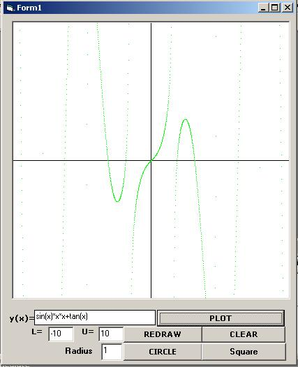



## A Function Plotter & Parser

### Description

This code is a demonstration of script control

in visual basic. Instead of using a handcrafted function parser it can be used and it would work possibly faster. The code also gives an idea about plotting. As I said it is a demonstation only. You can develop any optimization project onto it.
 
### More Info
 
The code is not commented, but it tells alot to an experienced eye.

             |
---                |---
**Submitted On**   |2002-03-27 16:47:34
**By**             |[Ali Osman BOYACI](https://github.com/Planet-Source-Code/PSCIndex/blob/master/ByAuthor/ali-osman-boyaci.md)
**Level**          |Advanced
**User Rating**    |4.6 (23 globes from 5 users)
**Compatibility**  |VB 6\.0
**Category**       |[Math/ Dates](https://github.com/Planet-Source-Code/PSCIndex/blob/master/ByCategory/math-dates__1-37.md)
**World**          |[Visual Basic](https://github.com/Planet-Source-Code/PSCIndex/blob/master/ByWorld/visual-basic.md)
**Archive File**   |[A\_Function658553272002\.zip](https://github.com/Planet-Source-Code/ali-osman-boyaci-a-function-plotter-parser__1-33115/archive/master.zip)

